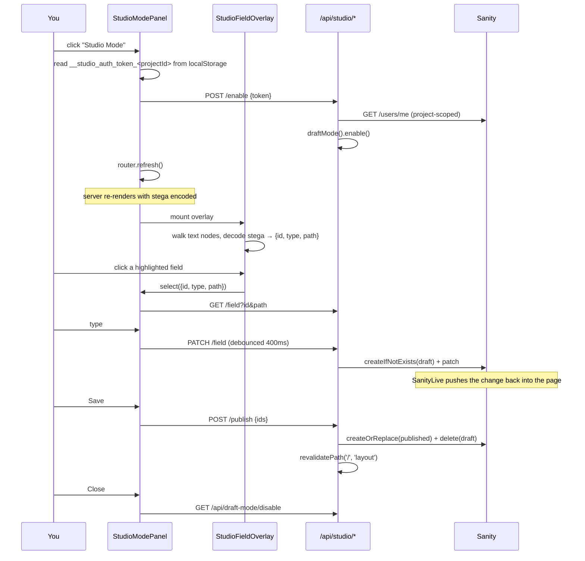

# Studio Mode

On-page editing for the portfolio. Toggle it from the site, click any field
that lights up, edit it in a floating panel, hit Save to publish — without
ever opening Sanity Studio.

---

## What it is not

It is **not** Sanity's Presentation Tool, and it deliberately does not use
`<VisualEditing>`'s overlay. That matters, because the obvious approach looks
like it should work and cannot:

```js
// @sanity/visual-editing — VisualEditing root
let [comlink, comlinkStatus] = useComlink(inFrame === true || inPopUp === true);

// SchemaProvider
if (!comlink) return;                       // ← standalone stops here
comlink.onStatus(() => fetchSchema(), "connected");

// ElementOverlayInner
function getContext(node) {
  let schemaType = getType(node), {field} = getField(node);
  if (!("id" in node) || !field || !schemaType) return;   // ← undefined
}

// useCustomComponents
if (!componentContext) return undefined;    // ← your resolver is never called
```

Visual Editing resolves fields against a schema it fetches **over comlink from
a parent Presentation frame**. On a standalone page there is no parent, so no
comlink, so no schema, so the field context is `undefined` and the
`components` resolver is never invoked. Nothing is drawn.

Studio Mode therefore reads the only field data that is genuinely present on
the page: the **stega** already embedded in the rendered text.

---

## Flow



---

## Files

| Path | Role |
| --- | --- |
| `src/components/StudioModeToggle.jsx` | The button. Owns no UI beyond itself — the panel it opens is rendered separately so it can float over the whole page. Currently placed in `Contact.jsx`, `(site)/work/[slug]/page.tsx` and `(site)/kiv/[slug]/page.tsx`. |
| `src/components/StudioModeContext.jsx` | Shared state: `open`, `selection`, `isDraftMode`, `fieldCount`, and the touched-document set. |
| `src/components/StudioModePanel.jsx` | The floating panel — auth, field loading, debounced patching, Save, Close, drag. |
| `src/components/StudioFieldOverlay.jsx` | Finds editable fields by decoding stega, measures them, draws the boxes. |
| `src/app/(site)/layout.tsx` | Mounts the provider with server-read `isDraftMode`, plus `<SanityLive>`. |
| `src/app/api/studio/enable/route.ts` | Verifies your Sanity session, turns Draft Mode on. |
| `src/app/api/studio/field/route.ts` | `GET` reads a field value, `PATCH` writes it to the draft. |
| `src/app/api/studio/publish/route.ts` | Publishes the named drafts, then revalidates. |
| `src/app/api/draft-mode/disable/route.ts` | Turns Draft Mode off on Close. |
| `src/app/api/draft-mode/enable/route.ts` | `defineEnableDraftMode` — for Presentation Tool only. Studio Mode does not use it. |

Styles live in `src/app/globals.css` under `.studio-toggle`, `.studio-panel*`,
`.studio-overlay`, `.studio-field*`.

---

## How a field becomes editable

In Draft Mode, `sanityFetch` stega-encodes every string it returns. The payload
rides along as zero-width characters (`U+200B`–`U+FEFF`) appended to the value:

```json
{
  "origin": "sanity.io",
  "href": "/studio/intent/edit/mode=presentation;id=profile;type=profile;path=role?…&id=profile&type=profile&path=role"
}
```

`StudioFieldOverlay` walks `document.body` text nodes, decodes any that carry
stega with `vercelStegaDecode`, and pulls `id`, `type` and `path` out of the
href's query string. On this site that finds ~41 fields, including array paths
like `stack[0]`.

Boxes are keyed by **element**, not by field — `name` renders in the nav, the
hero and the footer, and all three should be clickable.

**Only text nodes are scanned.** Image fields, `alt` text, and anything that
renders into an attribute rather than page text will not light up.

---

## Environment

| Variable | Required | Notes |
| --- | --- | --- |
| `SANITY_API_READ_TOKEN` | **yes — no default** | **Viewer role.** Without it there is no stega and nothing to click. |
| `SANITY_API_WRITE_TOKEN` | **yes — no default** | Editor/Developer role. Patches and publishing. |
| `NEXT_PUBLIC_SANITY_PROJECT_ID` | no | Falls back to `2i3f87ic`. |
| `NEXT_PUBLIC_SANITY_DATASET` | no | Falls back to `production`. |
| `NEXT_PUBLIC_SANITY_API_VERSION` | no | Falls back to `2026-08-01`. |
| `NEXT_PUBLIC_SANITY_STUDIO_URL` | no | Falls back to `/studio`. Whatever the value, it must end up defined — `defineLive` only enables stega when `client.config().stega.studioUrl` is set. |
| `NEXT_PUBLIC_SITE_URL` | no | Falls back to `http://localhost:3000`. Only `metadataBase`. |

The two tokens are the only ones with no fallback, and they are the two that
break Studio Mode. `src/sanity/env.ts` deliberately defaults the rest rather
than asserting, so an unset variable cannot fail a deploy during "collect page
data".

Two things worth internalising:

- **`SANITY_API_READ_TOKEN` must be a Viewer token, nothing higher.**
  `defineLive` hands it to the browser as `browserToken` whenever Draft Mode is
  on. A Developer-role token there means a write-capable credential is shipped
  to the client during every editing session.
- **These are read at process boot.** Editing `.env.local` while the dev server
  runs does nothing until you fully restart it. `.env.local` is gitignored, so
  deployments need both set in the host's environment.

---

## API contracts

### `POST /api/studio/enable`

```jsonc
// request
{"token": "<the Studio session from localStorage>"}
// 200
{"ok": true, "userId": "…"}
```

Verifies the token against project-scoped `/users/me`, so a bogus token, an
expired one, or one minted for a different project all `401`. Returns `503`
with `{"code": "no-read-token"}` if the server has no read token — it refuses
to enable Draft Mode into a state where there would be nothing to edit.

### `GET /api/studio/field?id&path`

Reads through `SANITY_API_READ_TOKEN`. Prefers the draft, falls back to
published. Resolves Visual Editing path syntax (`stack[0]`,
`items[_key=="a1b2"].title`).

```jsonc
{"value": "Independent Technologist"}
```

### `PATCH /api/studio/field`

Requires `SANITY_API_WRITE_TOKEN`. Forks a draft off the published document if
none exists, then sets the path. **Edits only ever land on drafts.**

```jsonc
{"id": "profile", "path": "role", "value": "…"}   // request
{"ok": true, "id": "drafts.profile", "path": "role"}
```

### `POST /api/studio/publish`

```jsonc
{"ids": ["profile"]}          // request
{"published": ["profile"]}
```

Publishes **only** the named documents. An empty list publishes nothing.

> There used to be a fallback that published every draft in the dataset when
> the caller named none. It fired during testing and published four
> `sanity.previewUrlSecret` documents. Nothing was lost that time, but the same
> code would as happily have published half-written work someone had open in
> Studio. Do not reintroduce it.

---

## Auth model

Studio Mode has no login of its own. It borrows the session Sanity Studio
already stored, same-origin, under `__studio_auth_token_<projectId>` in
`localStorage`, and posts it to the server for verification.

Draft Mode's cookie is then the authorisation for everything else — the field
and publish routes check `draftMode().isEnabled` rather than standing up a
second auth path, because only a verified session can have set it.

**Known limitation:** if Studio authenticated by *cookie* rather than token,
`localStorage` stays empty and Studio Mode cannot see the session. The panel
will say "Not signed in" even though you are. That case needs a different
mechanism and is not currently handled.

---

## Caching

Published reads are cached by `sanityFetch` with `revalidate: false`.
Publishing writes straight to Sanity, which Next has no way of knowing about —
so without an explicit invalidation the page keeps serving pre-publish HTML and
the edit looks like it never happened. Hence, after the publish transaction:

```ts
revalidatePath('/', 'layout');
```

`SanityLive` does revalidate on live events, but only while a page is open
listening. Closing Studio Mode immediately after Save beats it every time.

The `'layout'` argument matters: it invalidates the root layout **and every
route nested under it**, so the work and KIV detail pages are covered by the
same call. Editing a project title from `/work/<slug>` and editing it from the
home page both land correctly.

---

## Behaviour worth knowing

- **Live in-page updates lag 2.5–8.5s.** That is SanityLive's event round-trip,
  not a bug. The panel's own value updates instantly; the page catches up.
- **Only plain strings are editable.** Portable Text, images, arrays and
  references show a read-only "Edit it in Studio" link rather than being
  flattened into a textarea and destroyed.
- **`<title>` and OG tags never change.** They are hardcoded in
  `src/app/layout.tsx`, not driven by the profile document.
- **Publishing is per document, not per field.** Saving publishes the whole
  draft of every document you touched.
- **No mobile gating.** The overlay measures and draws at any viewport. Worth
  revisiting if it proves fiddly on touch.

---

## Troubleshooting

The panel names its own failures. Match the message:

| Panel says | Cause | Fix |
| --- | --- | --- |
| *Not signed in* | No `__studio_auth_token_*` in `localStorage` | Sign in at `/studio` in the same browser |
| *Session rejected* | Token expired, revoked, or for another project | Sign in again |
| *Server is missing SANITY_API_READ_TOKEN* | Read token absent from the running process | Set it, restart fully |
| *No editable fields found* | Draft Mode on but no stega on the page | Read token missing or `NEXT_PUBLIC_SANITY_STUDIO_URL` undefined |
| *Could not load `<field>`* | The `GET` failed; real server error shown inline | Read the message |
| Inline red text under the textarea | A `PATCH` failed | Usually `SANITY_API_WRITE_TOKEN` missing |
| *(N found)* | Working normally | — |

Two console checks that split most problems immediately:

```js
(document.body.innerText.match(/[\u200B-\u200D\uFEFF]/g) || []).length  // stega
document.querySelectorAll('.studio-field').length                       // boxes
```

Healthy on this site: ~34,000 and 41. Also compare the SanityLive log —
`<SanityLive includeDrafts>` means the read token is live;
plain `<SanityLive>` means it is not.

---

## Implementation notes

Three non-obvious things that are load-bearing:

**The rAF guard must reset its id.** `measure()` bails while a frame is
pending. The cleanup cancels the frame — and must also set `frame.current = 0`.
The effect re-runs on every `fields` change and twice on mount under
StrictMode, so the cleanup lands mid-flight constantly. Leaving a stale id
wedges measurement shut permanently: fields are found, no boxes ever render,
and nothing errors.

**The overlay mutates the DOM its own observer watches.** Rendering boxes into
`document.body` triggers the `MutationObserver`, so the rescan only commits
when the set of field keys actually differs. It also drops elements that fail
`isConnected` — React swaps nodes when text changes — and invalidates the
signature so the next mutation does a real rescan.

**Errors must not be swallowed.** Early versions used bare `catch { return
null }` and reported every server failure as "isn't a plain text field", which
points at the content when the cause is configuration. Load failures and save
failures are now separate states with the server's own message.
